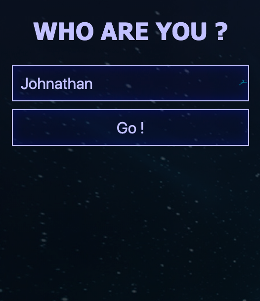
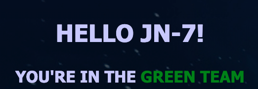
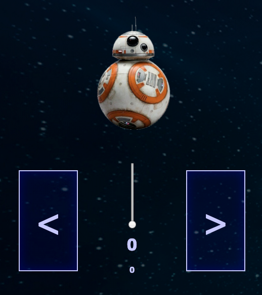
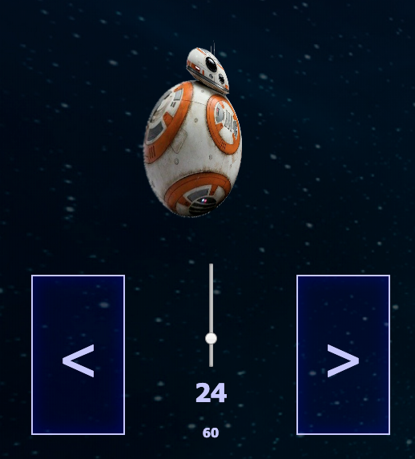

# Dojo modern web with Star Wars

- [Dojo modern web with Star Wars](#dojo-modern-web-with-star-wars)
  - [Front](#front)
    - [Router](#router)
    - [Le store](#le-store)
    - [Login](#login)
      - [Générer le nom du pilote](#générer-le-nom-du-pilote)
      - [Générer l'équipe couleur du pilote](#générer-léquipe-couleur-du-pilote)
      - [Rediriger vers le poste de pilotage](#rediriger-vers-le-poste-de-pilotage)
    - [Dashboard](#dashboard)
      - [Information du pilote](#information-du-pilote)
      - [Le cockpit](#le-cockpit)
  - [Back](#back)
    - [Node.JS](#nodejs)
    - [Socket.io](#socketio)
      - [Côté back](#côté-back)
      - [Côté front](#côté-front)
  - [IOT](#iot)

L'idée de ce dojo est de se plonger dans l'univers de Star Wars pour créer une web app mobile afin de controler un drone BB-8. Quel programme !

Le Dojo se découpe en 3 parties où nous utiliserons des technologies et des méthodes différentes et relativement récentes :

- Front : Svelte, BEM, CSS avancée avec des transiosn et des effets
- Back : Node.JS, Socket.IO
- IOT : Cylon.js

Si vous d'expérimenter d'autres technologie front ou back, aucun problème

## Front

Rentrons dans le vif du sujet, la partie Front sera développée en Svelte en respectant la convention de nommage de classe BEM.

Pour rappel BEM est une convention de nommage de classe facilitant la découpe en composant nottament. Vous pouvez retrouvez des informations sur BEM dans [cette présentation](https://speakerdeck.com/johnmeunier/developer-improve-your-dom-structure-with-bem).

Dans un premier temps, il faut initialiser un nouveau projet Svelte, vous pouvez vous inspirer de la [doc officiel](https://svelte.dev/blog/the-easiest-way-to-get-started). Personnellement j'ai utilisé la méthode _1. Use the REPL_ qui est la plus facile à mettre en place malgré des problèmes possible de proxy.

### Router

L'application sera composée de deux pages :

- Login, cette page servira simplement à se connnecter
- Dashboard, cette page affichera votre nom de droid, votre équipe et vous fournira surtout le cockpit pour controler votre drone.

Pour ce faire, il faut mettre en place un routeur. Svelte n'en contient pas par défaut. Je vous conseille le package `svelte-routing`.

Il vous suffit après d'importer les composants utiles :

```js
import { Router, Link, Route } from "svelte-routing";
```

L'utilisation du router est très classique. Les `route` doivent être compris dans un composant `router` et il faut renseigner au moins deux éléments indispensables :

- `path` : le chemin de votre route
- `component` : le composant à charger quand le paramètre `path` matche.

Par exemple :

```js
<Router {url}>
  <div class="container">
    <Route path="login" component={Login} />
    <Route path="dashboard" component={Dashboard} />
  </div>
</Router>
```

Le paramètre `url` ne sert pas dans notre cas mais doit au moins être indiqué à une string vide.

### Le store

Nous allons utiliser un store pour stocker les données de l'utilisateur actuellement connecté.

Il suffit de créer un fichier `src/stores.js`

```js
import { writable } from "svelte/store";

export const user = writable({
  name: "John",
  surname: "JN-2",
  color: "red"
});
```

Pour utiliser votre store il faut l'importer où vous souhaitez l'utiliser, par exemple dans notre `Login.svelte`

```js
import { user } from "../stores.js";
```

Pour modifier notre utilisateur, il faut utiliser la méthode `update`

```js
user.update(user => ({
  ...user,
  name: e.target.value
}));
```

Et pour écouter une valeur : 

```js
I const unsubscribe = user.subscribe(value => {
  user_value = value;
}); 
```

On aura ici un store qui contiendra à l'initialisation un user avec des informations par défaut.

Maintenant que nous avons mis en place un router et un store, nous pouvons maintenant passer aux détails de chaque page.

Les illustrations sont seulement là à titre d'exemple. L'objectif est de créer une interface dans le thème de Star Wars, faîtes parler votre imagination.

### Login



La page de Login est le premier point d'entrée vers le poste de pilotage du droid. Elle doit faire deux choses : 
- Créer le pseudo du pilote
- Assigner une couleur au pilote

Dans un premier temps, il faut créer le formulaire de login

```html
<h2>Who are you ?</h2>
<input on:input={nameHandler} placeholder="Your name" class="btn size-full" />
<button on:click={go} class="btn size-full">Go !</button>
```

Ce formulaire a deux actions. Dans un premier temps il met à jour le nom de l'utilisateur dans le store. pour ce faire, il suffit de suivre ce qu'on s'est dit précedemment pour la mise à jour d'une valeur du store, ici on cherche à mettre à jour l'attribut name de la clé user.

Lorsque l'utilisateur valide le formulaire de connexion, plusieurs choses sont à faire, notamment mettre à jour le pseudo et la couleur du pilote dans le store et rediriger vers le poste de pilotage.

#### Générer le nom du pilote

Comme le nom de beaucoup de droid, le but ici est de générer un pseudo sous la forme [Lettre][Lettre]-[Nombre] où la première lettre correspond à la première lettre du nom de l'utilisateur saisi dans le champ, la deuxième lettre correspond à la dernière lettre du nom de l'utilisateur saisi dans le champs, et le nombre correspond au nombre de lettre compris entre la première lettre et la dernière lettre du nom de l'utilisateur saisi dans le champ. 

Voici différents exemple : 
- John => JN-2
- Johnathan => JN-7
- Jérôme => JE-4
- Internationalization => IN-18

Ce pseudo est a assigner à la clé `user` dans le store dans l'attribut `surname`.

#### Générer l'équipe couleur du pilote

Une couleur doit être assigné à chaque utilisateur aléatoirement, plusieurs utilisateurs peuvent avoir la même couleur. La couleur assigné doit être compatible avec le drone Sphero BB-8, par exemple : 
- blue
- green
- red
- pink 
- yellow

#### Rediriger vers le poste de pilotage

Très simplement, après avoir mis à jour l'utilisateur dans le store, il faut rediriger vers le dashboard. Pour rappel, on utilise [svelte-routing](https://github.com/EmilTholin/svelte-routing).

### Dashboard

#### Information du pilote



Le dashboard doit d'abord être contenir un composant affichant les informations de l'utilisateur comme son pseudo et son équipe

#### Le cockpit



Le Dashboard doit permettre plusieurs choses : 
- Afficher l'état du drone
- Augmenter ou réduire la vitesse
- Effectuer une rotation dans le sens horaire
- Effectuer une rotation dans le sens trigonométrique

L'affichage principal comprend un composant affichant une image de BB-8 qui sera transformé en CSS pour schématiser l'état dans lequel il se trouve. Il comprend également la valeur numérique de sa vitesse et de sa rotation.



Comme vous pouvez le voir sur ce screenshot, l'image de BB-8 se trouve transformé pour schématiser son état. Ici on imagine qu'il se déplace vers la gauche à environ 1/4 de sa vitesse.

Pour faire ça, on va rajouter du style dynamique directement via l'HTML. Ce style va jouer sur la propriété `transform`. Nous jouerons plus précisemment avec les valeurs de `rotateX` et de `rotateY` qui permettront, via de simple transformations 2D, de donner un début d'effet 3D. Il vous faudra également jouer avec la valeur de `translateX` pour ajuster le positionnement de l'image. Cet effet est uné ébauche de rendu réaliste, il est possible de faire bien mieux avec des effets 3D ou du SVG par exemple mais ce serait beaucoup plus long. N'hésitez pas à expérimenter après le dojo sur cette partie. 

## Back

Le back va permettre de faire le lien entre le post de pilotage et le drone. L'idée est donc de pouvoir récupérer les commandes que vous envoyez dans l'application web (augmentation de la puissance, virage notamment), de les transformer en commande compréhensibles par le drone puis de lui envoyer.

Pour le moment on va se focaliser sur les liens entre l'interface et le serveur.

Cette partie se fera en Node.js avec socket.io.

### Node.JS

Pour initialiser votre projet, vous pouvez en créer un nouveau parallèle à votre front et lancer à l'intérieur :

```
npm init
```

Vous pouvez maintenant créer un nouveau fichier js (par exemple _index.js_) et l'exécuter.

Pour l'exécuter, le plus simple reste la commande :

```
node index.js
```

Je vous conseille cependant d'utiliser [nodemon](https://www.npmjs.com/package/nodemon) qui vous relancera votre serveur automatiquement dès que vous faites une modification à l'intérieur :

```
npm install -g nodemon
nodemon index.js
```

### Socket.io

#### Côté back

En tout premier, il faut ajouter socket.io à votre projet. Pour ce faire, rien de plus simple :

```
npm install socket.io
```

Maintenant que le package socket.io a été ajouté à notre projet, il faut démarrer le serveur.

```js
const io = require("socket.io");
const server = io.listen(3000);
```

Ici on indique que notre serveur sera disponible sur le port 3000.

Socket.io fonctionne sur le principe de trigger sur différents type d'événement envoyé et reçu.

```js
server.on("connection", socket => {
  console.log("### new user detected ###");
  socket.emit("welcome", droneState);
});
```

Ici on indique que lorsque l'événement `connection` est détecté on émet un événement de type `welcome` en envoyant l'objet `droneState` à l'utilisateur connecté au serveur.

En ayant simplement compris cette règle, on peut développer une grande partie de l'application.

Il est également possible d'envoyer un événement à tous les utilisateurs connectés :

```js
socket.broadcast.emit("newState", droneState);
```

Ok, tout ça c'est très bien, maintenant on sait envoyer et recevoir des événements côté serveur mais quid au niveau de l'interface ? Il va falloir également utiliser socket.io pour se connecter à la socket et communiquer avec.

#### Côté front

On va déjà appeler le script de socket.io dans notre html via le fichier `public/index.html`

```html
<script src="http://localhost:3000/socket.io/socket.io.js"></script>
```

Il ne vous reste plus qu'à créer votre socket en se connectant au serveur précédemment lancé :

```js
socket = io("http://localhost:3000");
```

Tout s'utilise maintenant de la même façon qu'en back. Par exemple :

```js
socket.on("newState", newDroneState => {
  droneState = newDroneState;
});
```

Cette exemple permet d'écouter l'événement précédemment émi `newState`, de récupérer le nouvel état du drone, et de l'assigner à l'état affiché dans l'interface.

## IOT
